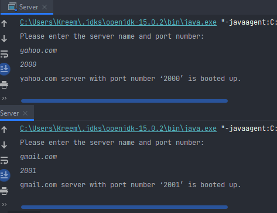
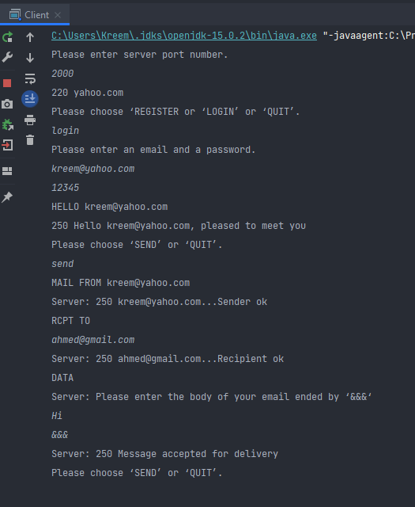
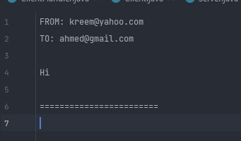

# SMTP Emulator
SMTP emulator using Java. Runs as either a server or a client, multiple clients can join a single server and cross server communication is supported, so clients can send emails to each other even if they are not connected to the same server.  
This program was made an assignment for the Networking course taught by Cairo University - Faculty of Computers and Artificial Intelligence.

## How to run the app:
1. Run the [server main function](src/Server.java).
2. Enter the server's name and port
3. Run as many clients as you want with the [client main function](src/Client.java).
4. Inboxes as well as other server information can be found in the working directory of the application

### Available commands are:
- `REGISTER`
- `LOGIN`
- Send message (`MAIL FROM`, `RCPT TO`, `DATA`)

### Examples:
#### Running servers:

#### Sending a cross-server message:

#### Result in the recipient's inbox:

